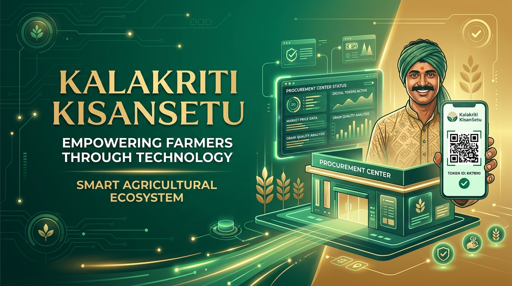
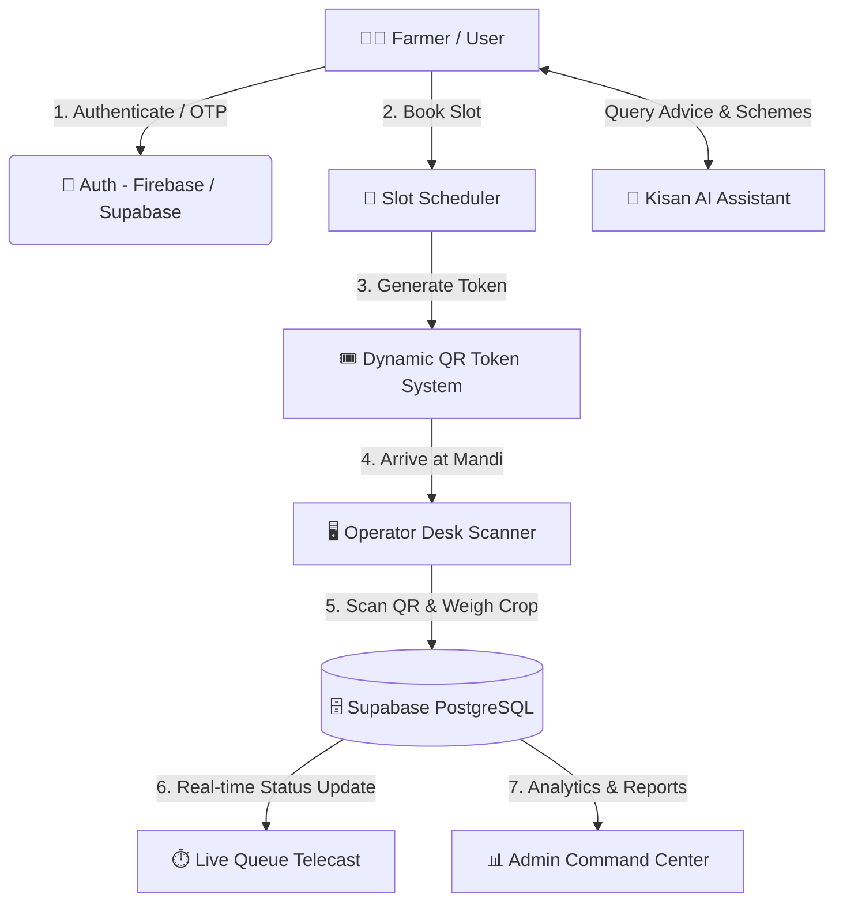
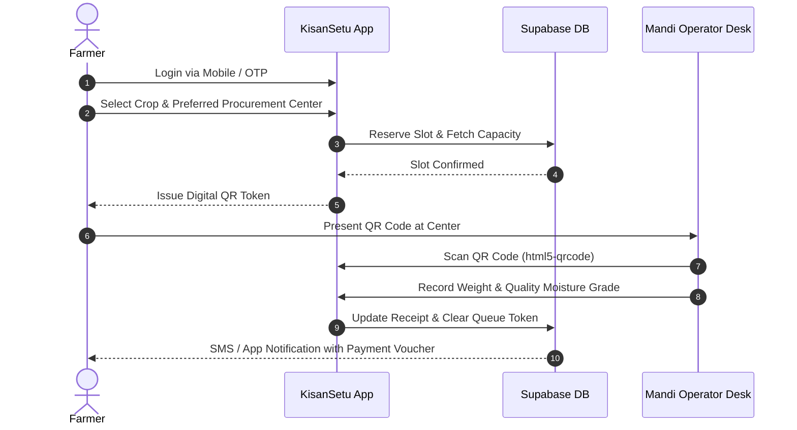

<div align="center">

  

  # 🌾 Kalakriti | KisanSetu ( किसान सेतु )
  ### *Smart Agricultural Procurement & Real-Time Queue Management System*

  [](https://nextjs.org/)
  [](https://react.dev/)
  [](https://www.typescriptlang.org/)
  [](https://tailwindcss.com/)
  [](https://supabase.com/)
  [](https://firebase.google.com/)
  [](https://github.com/foresto-dreamer/Kalakriti/pulls)

  <p align="center">
    <b>Empowering farmers, streamlining crop procurement, and eliminating long mandis queues through digital tokens, real-time tracking, and AI support.</b>
  </p>

  [Explore Features](#-key-features) •
  [Architecture](#-system-architecture) •
  [Quickstart](#-quickstart-guide) •
  [Tech Stack](#-tech-stack) •
  [Contributing](#-contributing)

</div>

---

## 📌 Overview

**Kalakriti (KisanSetu)** is an enterprise-grade agricultural ecosystem built to bridge the gap between Indian farmers and grain procurement centers (Mandis). 

By digitizing crop slot scheduling, issuing dynamic **QR-coded tokens**, and providing **live queue telecast**, KisanSetu drastically reduces wait times, prevents mandi congestion, and guarantees fair, transparent crop evaluation.

---

## 🌟 Key Features

| Feature | Description | Target Users |
| :--- | :--- | :--- |
| **👨‍🌾 Farmer Portal & Digital ID** | SMS OTP / Aadhaar-linked login, digital land records, crop registration, and past transaction history. | Farmers |
| **📅 Smart Slot Scheduler** | Book procurement appointments at nearest Mandis based on real-time center capacity and commodity availability. | Farmers |
| **🎟️ Digital QR Token System** | Instant QR code token generation upon slot confirmation for automated check-ins. | Farmers / Staff |
| **⏱️ Live Queue Tracking** | Real-time queue position monitor, estimated waiting times, and live token broadcast. | Farmers / Public |
| **🔍 Procurement Center Finder** | Interactive directory of grain centers with live operational status, operating hours, and storage limits. | All |
| **🖥️ Operator Desk & Scanner** | Staff dashboard with built-in camera QR scanner (`html5-qrcode`), crop moisture check, weighing, & instant receipt generation. | Mandi Operators |
| **📊 Admin Command Center** | Operational analytics, queue bottleneck detection, staff allocation, and one-click Excel data exports (`xlsx`). | Government / Admins |
| **🤖 Multilingual Kisan AI Assistant** | AI-driven chatbot providing crop advisory, market MSP insights, and portal navigation in regional languages. | Farmers |

---

## 🏗️ System Architecture



### 🔁 Operational Workflow



---

## 💻 Tech Stack

### **Frontend & Framework**
- **Framework:** [Next.js 16](https://nextjs.org/) (App Router)
- **UI Core:** [React 19](https://react.dev/), TypeScript
- **Styling:** [Tailwind CSS v4](https://tailwindcss.com/)
- **Icons & QR:** Lucide Icons, `qrcode`, `html5-qrcode`

### **Backend & Database**
- **Database & SSR:** [Supabase PostgreSQL](https://supabase.com/) (`@supabase/supabase-js`, `@supabase/ssr`)
- **Authentication:** Supabase Auth & Firebase Auth
- **AI Integration:** Firebase AI Logic / Gemini API Integration
- **Data Export:** `xlsx` (Excel Spreadsheet Generation)

---

## 📂 Project Structure

```ascii
kalakriti/
├── 📁 src/
│   ├── 📁 app/                    # Next.js App Router Pages
│   │   ├── 📁 admin/              # Admin Analytics & Management Dashboard
│   │   ├── 📁 api/                # API Endpoints (Queue, Auth, Slots)
│   │   ├── 📁 centers/            # Procurement Centers Directory
│   │   ├── 📁 operator/           # Mandi Operator Check-in Desk
│   │   ├── 📁 profile/            # Farmer Profile & Crop History
│   │   ├── 📁 queue/              # Live Queue Public Tracker
│   │   └── 📁 scheduler/          # Appointment & Token Booking System
│   ├── 📁 components/             # Reusable UI Components
│   │   ├── 🧩 FarmerProfilePage.tsx
│   │   ├── 🧩 KisanChatbot.tsx
│   │   ├── 🧩 LiveQueue.tsx
│   │   ├── 🧩 LoginPortal.tsx
│   │   ├── 🧩 Navbar.tsx
│   │   ├── 🧩 OperatorDesk.tsx
│   │   ├── 🧩 ProcurementCenters.tsx
│   │   └── 🧩 ScheduleBooking.tsx
│   ├── 📁 hooks/                  # Custom React Hooks
│   └── 📁 lib/                    # Supabase & Firebase Clients, Utilities
├── 📁 public/                     # Static Assets & Banners
├── 📄 database.types.ts           # Auto-generated Supabase Type Definitions
├── 📄 QUEUE_LOGIC.md              # Technical Specification for Queue Engine
└── 📄 package.json                # Project Dependencies & Scripts
```

---

## 🚀 Quickstart Guide

### 1. Prerequisites
Make sure you have the following installed on your machine:
- **Node.js** `>= 20.0.0`
- **npm** `>= 10.0.0` or **pnpm** / **yarn**

### 2. Clone & Setup Repository
```bash
# Clone your repository fork
git clone https://github.com/foresto-dreamer/Kalakriti.git
cd Kalakriti

# Ensure you are on the main branch
git checkout main

# Install dependencies
npm install
```

### 3. Configure Environment Variables
Create a `.env.local` file in the root directory:

```env
# Supabase Configuration
NEXT_PUBLIC_SUPABASE_URL=https://your-supabase-project.supabase.co
NEXT_PUBLIC_SUPABASE_ANON_KEY=your-supabase-anon-key

# Firebase Configuration (Optional for Auth / AI features)
NEXT_PUBLIC_FIREBASE_API_KEY=your-firebase-api-key
NEXT_PUBLIC_FIREBASE_AUTH_DOMAIN=your-app.firebaseapp.com
NEXT_PUBLIC_FIREBASE_PROJECT_ID=your-project-id
```

### 4. Run Development Server
```bash
npm run dev
```

Open [http://localhost:3000](http://localhost:3000) in your browser to view the application live!

---

## 🤝 Contributing

Contributions are welcome! If you'd like to contribute to **Kalakriti**:

1. **Fork** the repository (`foresto-dreamer/Kalakriti`).
2. Create your feature branch (`git checkout -b feature/AmazingFeature`).
3. Commit your changes (`git commit -m 'Add some AmazingFeature'`).
4. Push to the branch (`git push origin feature/AmazingFeature`).
5. Open a **Pull Request** to the `main` branch.

---

## 📜 License

This project is licensed under the **MIT License**.

---

<div align="center">
  <sub>Built with ❤️ for <b>Smart India Hackathon (SIH)</b> • Designed for Indian Agriculture</sub>
</div>
